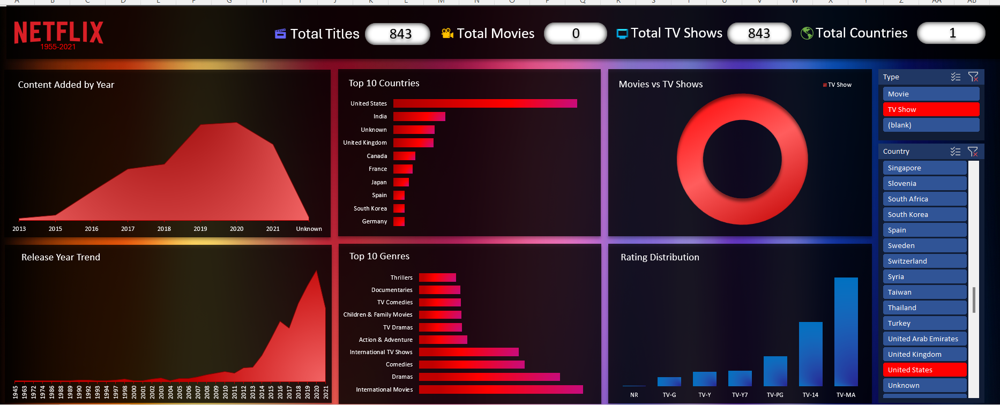

# 🎬 Netflix Data Analysis & Excel Functions Dashboard

> 📊 **Interactive Excel Data Analysis Project | Netflix Movies & TV Shows**

This project is an Excel-based **Netflix Data Analysis and Dashboard project** created to explore Netflix movies and TV shows using data cleaning, analysis, visualization, Excel formulas, and dashboard techniques.

The workbook combines **data analysis, country and genre separation, KPI analysis, dashboard visualization, and advanced Excel functions** such as **VLOOKUP, INDEX-MATCH, IF, and Nested IF**.

---

## 📊 Dashboard Preview



> 💡 **Dashboard Preview:** The dashboard provides a visual overview of Netflix content with KPIs, yearly trends, Top 10 Countries, Top 10 Genres, Movies vs TV Shows, Rating Distribution, and interactive slicers for **Type** and **Country**.

---

## 📌 Project Overview

The main objective of this project is to analyze Netflix's content library and extract meaningful insights from the available dataset.

The project covers:

- 🎬 Movies vs TV Shows analysis
- 🌍 Country-wise analysis
- 🎭 Genre-wise analysis
- 📅 Release year analysis
- ⭐ Rating analysis
- ⏱️ Duration analysis
- 📊 KPI-based analysis
- 📈 Dashboard visualization
- 🔎 Lookup functions
- 🧠 Conditional and nested functions

The workbook is designed as a practical demonstration of how **Microsoft Excel can be used for data analysis and business intelligence.**

---

## 📂 Workbook Structure

### 1️⃣ Data

The main dataset containing Netflix content information.

Important columns include:

- `show_id`
- `type`
- `Title`
- `Country`
- `Date_added`
- `Release_year`
- `Rating`
- `Duration`
- `Listed_in`
- `Added year`
- `Sorted Genre`
- `Sorted Country`
- `Sr no.`

This sheet acts as the primary source for the analysis.

---

### 2️⃣ Split Country

This sheet contains country information separated from the original dataset.

It helps in performing detailed **country-level analysis** and organizing multiple-country values.

---

### 3️⃣ Splited Genres

This sheet contains separated genre/category information from the Netflix dataset.

It can be used for analyzing Netflix content based on different genres and categories.

---

### 4️⃣ Analysis

The Analysis sheet contains the calculated results and analytical sections used to understand the Netflix dataset.

It includes areas such as:

- 🎬 Movies vs TV Shows
- 📅 Release Year Trend
- 📊 Total Movies & TV Shows KPIs
- 🌍 Total Countries
- 📈 Analytical summaries
- 📊 Supporting data for visualization

---

### 5️⃣ Dashboard

The Dashboard provides a visual representation of the Netflix analysis.

### Dashboard Highlights

- 🎬 **Total Titles**
- 🎥 **Total Movies**
- 📺 **Total TV Shows**
- 🌍 **Total Countries**
- 📈 **Content Added by Year**
- 🌎 **Top 10 Countries**
- 🎭 **Top 10 Genres**
- 🎬 **Movies vs TV Shows**
- ⭐ **Rating Distribution**
- 📅 **Release Year Trend**
- 🔎 **Interactive Type Slicer**
- 🌍 **Interactive Country Slicer**

The slicers allow the dashboard data to be filtered interactively in Excel.

---

### 6️⃣ Functions

The Functions sheet demonstrates practical Excel formula usage on the Netflix dataset.

It contains examples of:

- `VLOOKUP`
- `INDEX + MATCH`
- `IF`
- `Nested IF`
- `IF + VLOOKUP`
- `IF + INDEX-MATCH`
- Combined formula-based results

The sheet uses Netflix records to demonstrate how lookup and conditional functions can be applied to real-world data.

---

# 🧮 Excel Functions Demonstrated

## 🔹 VLOOKUP

VLOOKUP is used to search for a Show ID and retrieve corresponding information such as the content type.

Example:

```excel
=VLOOKUP(B2,Data!$A$2:$M$8808,2,FALSE)
```

This searches for the Show ID and returns the corresponding content type.

---

## 🔹 INDEX + MATCH

INDEX-MATCH is used as a flexible lookup method for retrieving information from the dataset.

Example:

```excel
=INDEX(Data!$C$2:$C$8808,MATCH(B2,Data!$A$2:$A$8808,0))
```

This searches for the Show ID and returns the corresponding title.

---

## 🔹 IF Function

The IF function is used to classify Netflix content based on conditions.

Example:

```excel
=IF(C2="Movie","Movie Content","TV Content")
```

This identifies whether the content is a Movie or TV Show.

---

## 🔹 Nested IF

Nested IF conditions are used to create multiple categories based on different conditions.

For example, movie duration can be classified into:

- Short Movie
- Medium Movie
- Long Movie

TV Shows can also be categorized based on the number of seasons.

This demonstrates how multiple conditions can be combined within Excel.

---

## 🔹 IF + VLOOKUP

A combination of IF and VLOOKUP is used to evaluate information retrieved from the Data sheet.

Example concept:

```excel
=IF(VLOOKUP(...)=...,...,...)
```

---

## 🔹 IF + INDEX-MATCH

INDEX-MATCH can also be combined with IF conditions to generate meaningful text results.

Example concept:

```excel
=IF(...,"Movie: "&INDEX(...),"TV Show: "&INDEX(...))
```

---

# 📊 Key Analysis Areas

### 🎬 Movies vs TV Shows

Analyzes the distribution of Movies and TV Shows available in the dataset.

### 📅 Release Year

Examines how Netflix content is distributed across different release years.

### 🌍 Countries

Analyzes the countries associated with Netflix titles.

### 🎭 Genres

Examines content based on categories and genres.

### ⭐ Ratings

Provides an understanding of the rating distribution of Netflix content.

### ⏱️ Duration

Analyzes movie duration and TV Show season information.

---

# 📈 Dashboard Features

The dashboard is designed to provide a quick overview of the Netflix dataset.

Key dashboard elements include:

- 📌 KPI cards
- 📊 Charts
- 🎬 Movies vs TV Shows visualization
- 📅 Content Added by Year
- 📈 Release Year Trend
- 🌎 Top 10 Countries
- 🎭 Top 10 Genres
- ⭐ Rating Distribution
- 🔎 Type slicer
- 🌍 Country slicer
- 📊 Interactive filtering

The dashboard helps transform raw data into an easy-to-understand visual presentation.

---

# 🧠 Data Analysis Workflow

```text
Raw Netflix Data
       ↓
Data Cleaning & Preparation
       ↓
Country & Genre Separation
       ↓
Data Analysis
       ↓
Excel Functions
       ↓
KPI Creation
       ↓
Charts & Visualizations
       ↓
Interactive Dashboard
       ↓
Business Insights
```

---

# 🛠️ Tools & Technologies Used

- 📊 Microsoft Excel
- 📈 Excel Charts
- 🔎 VLOOKUP
- 🧮 INDEX-MATCH
- 🧠 IF Conditions
- 🔄 Nested IF
- 📊 KPI Analysis
- 🎨 Excel Dashboard
- 🗂️ Data Cleaning
- 📑 Data Transformation

---

# 🎯 Learning Outcomes

Through this project, the following Excel and data analysis concepts are demonstrated:

- Understanding structured datasets
- Cleaning and organizing data
- Separating multi-value fields
- Creating analytical tables
- Using lookup functions
- Using logical functions
- Creating nested conditions
- Creating KPIs
- Building Excel dashboards
- Creating meaningful visualizations
- Presenting data-driven insights

---

# 💡 Why This Project?

Netflix is a useful real-world dataset for demonstrating practical data analysis because it contains multiple dimensions such as:

- Content Type
- Country
- Release Year
- Rating
- Duration
- Genre
- Date Added

By analyzing these dimensions, the project demonstrates how raw data can be transformed into structured analysis and visual insights using Excel.

---

# 📁 Project Files

```text
Netflix-Data-Analysis/
│
├── DATASET
├── DASHBOARD.png
└── README.md
```

> 📌 **Important:** Keep `DASHBOARD.png` in the same GitHub repository folder as `README.md` so the Dashboard Preview image appears correctly on GitHub.

---

# 📌 Workbook Summary

| Sheet | Purpose |
|---|---|
| Data | Main Netflix dataset |
| Split Country | Separated country information |
| Splited Genres | Separated genre information |
| Analysis | Calculations, KPIs & analytical summaries |
| Dashboard | Visual dashboard & interactive filtering |
| Functions | VLOOKUP, INDEX-MATCH, IF & Nested IF demonstrations |

---

# 🚀 How to Use

1. Download the Excel workbook.
2. Open the `.xlsx` file using Microsoft Excel.
3. Start with the **Data** sheet to understand the dataset.
4. Explore **Split Country** and **Splited Genres** for transformed data.
5. Open **Analysis** to view calculations and KPIs.
6. Open **Dashboard** to explore the visual analysis.
7. Use the **Type** and **Country** slicers to interact with the dashboard.
8. Open **Functions** to study the Excel formulas and lookup examples.
9. Experiment with the formulas to understand how Excel functions work with real-world data.

---

# 🏆 Project Highlights

✨ Real-world Netflix dataset  
✨ Structured data preparation  
✨ Country & genre transformation  
✨ Movies vs TV Shows analysis  
✨ KPI-based analysis  
✨ Interactive Excel dashboard  
✨ Dashboard slicers  
✨ VLOOKUP implementation  
✨ INDEX-MATCH implementation  
✨ IF conditions  
✨ Nested IF conditions  
✨ Combined Excel formulas  
✨ Data visualization  

---

# 📚 Skills Demonstrated

```text
Excel
Data Cleaning
Data Analysis
Data Transformation
Data Visualization
Dashboard Development
KPI Analysis
VLOOKUP
INDEX-MATCH
IF Conditions
Nested IF
Lookup Functions
Logical Functions
Business Intelligence
```

---

## AUTHOR🧑‍🎓

  # RAKESH

# ⭐ Conclusion

This Netflix Data Analysis project demonstrates how **Microsoft Excel can be used as a complete data analysis and visualization tool**.

From raw Netflix data to cleaned datasets, analytical calculations, Excel functions, KPIs, visualizations, interactive slicers, and dashboard presentation, the project provides an end-to-end example of practical Excel-based data analysis.

> **Built with Microsoft Excel 📊 | Data Analysis • Functions • Visualization • Dashboard**
